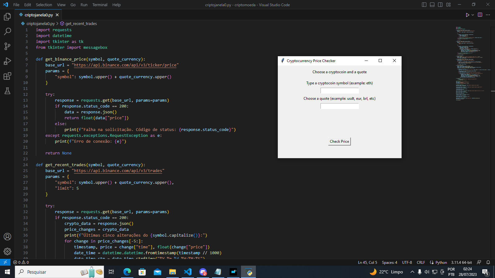

# ----- Desafio codigo Brazuca ------
# = Cryptocurrency price checker =

Desenvolvemos uma aplicação em Python que em tempo real mostra o preço e as 5 ultimas variaçoes das crypto moedas:   
## Bitcoin🪙 -Ethereum🪙- Matic🪙+


## Referência ------------------------------------

 - [API e documentação Binance ](https://binance-docs.github.io/apidocs/spot/en/#order-book)
 - [Blibioteca: Requests](https://requests.readthedocs.io/projects/pt/pt_BR/latest/user/quickstart.html)
 - [Blibioteca: Tinter](https://docs.python.org/3/library/tkinter.html)
 - [Blibioteca: Datetime](https://docs.python.org/pt-br/3/library/time.html)


## Instalação


```bash
 Para instalar a blibioteca resquests: pip install resquests
```
    
## Documentação da API ---------------------


### Price ticker 


| Parâmetro   | Tipo       | Descrição                           |
| :---------- | :--------- | :---------------------------------- |
| `symbol`    | `string` | **Símbolo da criptomoeda, por exemplo, "btc" para Bitcoin.**|


| Parâmetro   | Tipo       | Descrição                           |
| :---------- | :--------- | :---------------------------------- |
| `price`    | `float` | **Preço da moeda** |


### Trades List

| Parâmetro   | Tipo       | Descrição                           |
| :---------- | :--------- | :---------------------------------- |
| `symbol`    | `string` | **Símbolo da moeda** |

| Parâmetro   | Tipo       | Descrição                           |
| :---------- | :--------- | :---------------------------------- |
| `limit`    | `int` | **Ultimas alterações de valores** |

### Interface 


## Devs  -------------------------------                                                 
- [@Michael](https://github.com/Maicon-MK)== 👨‍💻 
- [@Renan](https://github.com/Rlf07)=== 👨‍💻       
- [@Kaiky](https://github.com/kaikyfersoa)====👨‍💻 


## Demonstração

Insira um gif ou um link de alguma demonstração


## Screenshots




